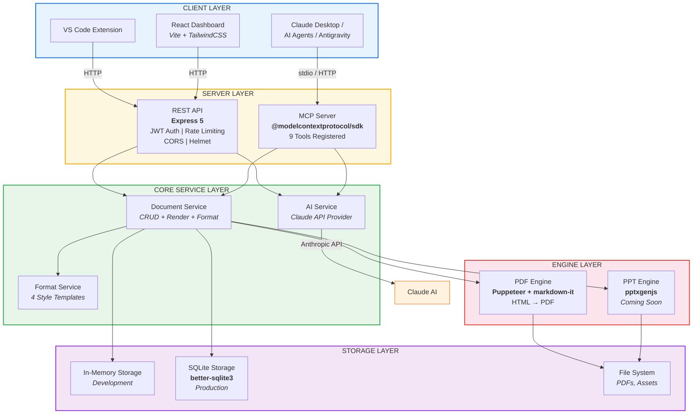
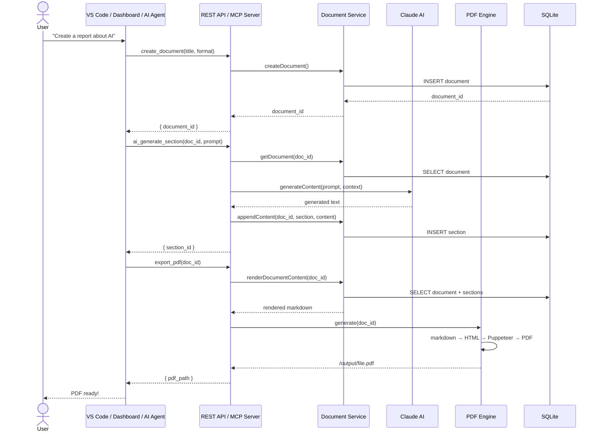
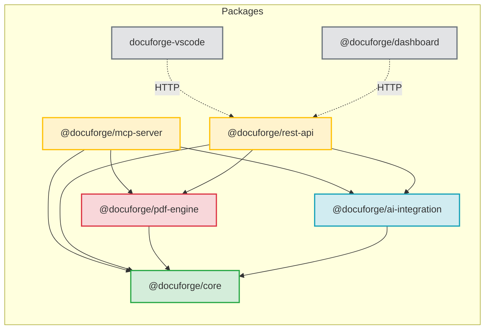
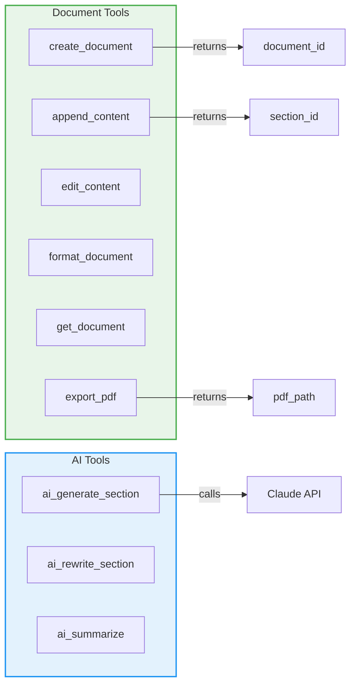
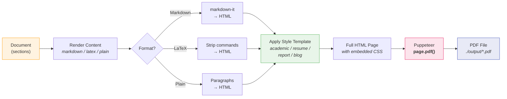
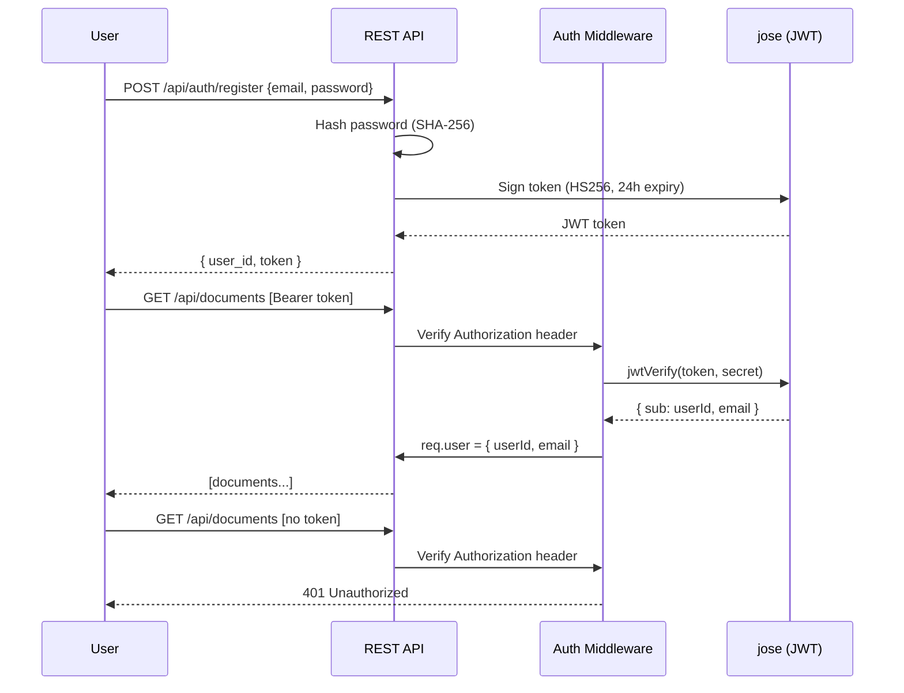
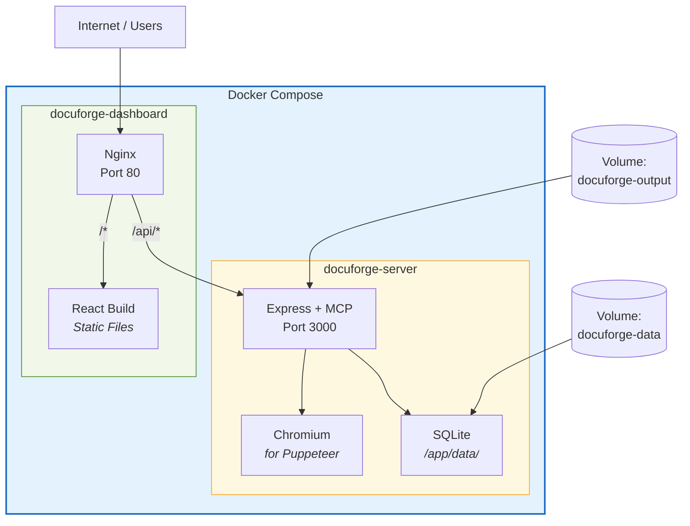

# DocuForge MCP

AI-powered document creation, editing, and PDF generation via MCP (Model Context Protocol).

## Quick Start

```bash
# Install dependencies
pnpm install

# Run MCP server (stdio - for Claude Desktop / IDE integration)
pnpm dev:mcp

# Run REST API server (port 3000)
STORAGE_TYPE=sqlite pnpm dev:api

# Run React dashboard (port 5173)
cd packages/dashboard && pnpm dev

# Test MCP server
pnpm test:mcp
```

## System Architecture



## Data Flow



## Package Structure



## MCP Tools



## PDF Generation Pipeline



## Authentication Flow



## Deployment Architecture



## IDE Integration

Add to your IDE's MCP config:

### Claude Desktop
`%APPDATA%\Claude\claude_desktop_config.json`

### Google Antigravity
`%USERPROFILE%\.gemini\antigravity\mcp_config.json`

### VS Code (Claude Code)
```bash
claude mcp add docuforge -- npx tsx /path/to/packages/mcp-server/src/index.ts
```

**Config format** (same for all):
```json
{
  "mcpServers": {
    "docuforge": {
      "command": "npx",
      "args": ["tsx", "C:/path/to/pdf-mcp-serve/packages/mcp-server/src/index.ts"],
      "env": {
        "ANTHROPIC_API_KEY": "your-key-here"
      }
    }
  }
}
```

## REST API

Start: `STORAGE_TYPE=sqlite pnpm dev:api`

| Method | Endpoint | Description |
|--------|----------|-------------|
| GET | `/api/health` | Health check |
| GET | `/api/documents` | List documents |
| POST | `/api/documents` | Create document |
| GET | `/api/documents/:id` | Get document |
| DELETE | `/api/documents/:id` | Delete document |
| POST | `/api/documents/:id/sections` | Add section |
| PUT | `/api/documents/:id/sections/:sid` | Edit section |
| POST | `/api/documents/:id/format` | Apply style |
| POST | `/api/documents/:id/export-pdf` | Export PDF |
| POST | `/api/documents/:id/ai/generate` | AI generate section |
| POST | `/api/documents/:id/ai/rewrite/:sid` | AI rewrite section |
| POST | `/api/documents/:id/ai/summarize` | AI summarize |
| POST | `/api/auth/register` | Register user |
| POST | `/api/auth/login` | Login |

## Environment Variables

| Variable | Default | Description |
|----------|---------|-------------|
| `STORAGE_TYPE` | `memory` | `memory` or `sqlite` |
| `SQLITE_PATH` | `./data/docuforge.db` | SQLite database path |
| `PDF_OUTPUT_DIR` | `./output` | PDF output directory |
| `PORT` | `3000` | REST API port |
| `ANTHROPIC_API_KEY` | - | Claude API key (enables AI tools) |
| `ANTHROPIC_MODEL` | `claude-sonnet-4-20250514` | AI model |
| `AUTH_ENABLED` | `false` | Enable JWT authentication |
| `JWT_SECRET` | `dev-secret` | JWT signing secret |

## Docker

```bash
cd docker
docker compose up --build
```

## Tech Stack

- **Runtime**: Node.js 22, TypeScript
- **MCP**: @modelcontextprotocol/sdk
- **PDF**: Puppeteer + markdown-it
- **Storage**: SQLite (better-sqlite3) / in-memory
- **API**: Express 5
- **AI**: Anthropic Claude SDK
- **Frontend**: React 19, Vite, TailwindCSS
- **Auth**: JWT (jose)
