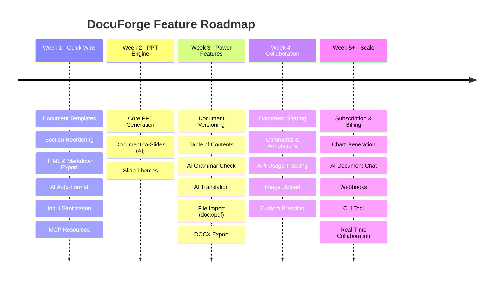
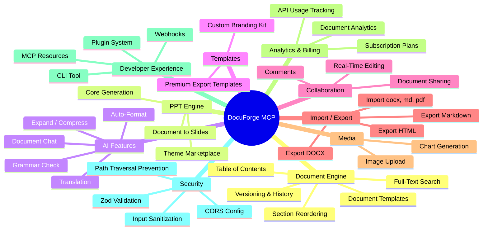
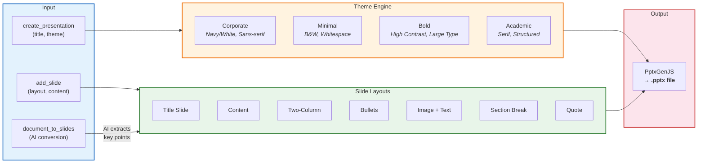

# DocuForge MCP - Feature Roadmap

## Current State (v0.1.0)

- 9 MCP tools (CRUD + format + PDF export + AI generate/rewrite/summarize)
- PDF generation via Puppeteer (4 styles: academic, resume, report, blog)
- SQLite + in-memory storage
- REST API with auth + rate limiting
- VS Code extension
- React dashboard
- Docker deployment

---

## Roadmap Overview



## Feature Map



## Feature Categories

### A. Document Engine Enhancements
### B. Presentation (PPT) Engine — NEW SERVICE
### C. Advanced AI Features
### D. Template Marketplace
### E. Collaboration & Multi-User
### F. Export & Import Formats
### G. Media & Asset Management
### H. Analytics & Billing
### I. Developer Experience
### J. Security Hardening

---

## A. Document Engine Enhancements

### A1. Document Versioning & History

**What**: Track every change to a document with version snapshots. Users can view history, compare versions, and rollback.

**Why**: Critical for production use. Users need undo capability and audit trails.

**New MCP Tools**:
- `get_document_history` — list all versions with timestamps
- `restore_version` — rollback to a specific version

**Implementation**:

```
packages/core/src/storage/
  └── Add `document_versions` table in SQLite:

CREATE TABLE document_versions (
  id TEXT PRIMARY KEY,
  document_id TEXT NOT NULL,
  version INTEGER NOT NULL,
  snapshot JSON NOT NULL,       -- full document state
  changed_by TEXT,
  created_at TEXT NOT NULL,
  FOREIGN KEY (document_id) REFERENCES documents(id) ON DELETE CASCADE
);
```

**Files to modify**:
- `packages/core/src/storage/sqlite-storage.ts` — add versions table, save snapshot on every update
- `packages/core/src/document-service.ts` — add `getHistory()`, `restoreVersion()` methods
- `packages/mcp-server/src/tools/` — add `get-history.ts`, `restore-version.ts`
- `packages/rest-api/src/routes/documents.ts` — add `GET /:id/history`, `POST /:id/restore/:version`

**Effort**: Medium (~3-4 hours)

---

### A2. Table of Contents Generation

**What**: Auto-generate a TOC from document sections with page numbers in PDF.

**Why**: Essential for academic papers, reports, and long documents.

**Implementation**:
- Add `generateToc()` method in `packages/core/src/document-service.ts`
- Update `packages/pdf-engine/src/html-templates.ts` to render TOC as first page
- TOC links work as anchors in the HTML before Puppeteer converts to PDF

**Effort**: Small (~1-2 hours)

---

### A3. Section Reordering

**What**: Move sections up/down within a document.

**New MCP Tool**: `reorder_sections` — document_id, section_id, new_position

**Implementation**:
- Add `reorderSection()` in `DocumentService`
- New tool file: `packages/mcp-server/src/tools/reorder-sections.ts`
- REST endpoint: `PUT /api/documents/:id/reorder`

**Effort**: Small (~1 hour)

---

### A4. Document Search

**What**: Full-text search across all documents.

**New MCP Tool**: `search_documents` — query string, returns matching documents/sections

**Implementation**:
- SQLite FTS5 virtual table for full-text search:
  ```sql
  CREATE VIRTUAL TABLE sections_fts USING fts5(title, content, content=sections, content_rowid=rowid);
  ```
- New method in `SqliteStorage`: `searchDocuments(query: string)`
- REST endpoint: `GET /api/documents/search?q=keyword`

**Effort**: Medium (~2-3 hours)

---

### A5. Document Templates

**What**: Pre-built document templates (research paper, business plan, meeting notes, etc.) that users can start from.

**New MCP Tool**: `create_from_template` — template_name, title

**Implementation**:
- New file: `packages/core/src/templates.ts` — define template structures with pre-filled sections
- Templates: `research-paper`, `business-plan`, `meeting-notes`, `project-proposal`, `technical-spec`, `newsletter`
- Each template = title pattern + pre-defined section titles + optional placeholder content

**Effort**: Small (~2 hours)

---

## B. Presentation (PPT) Engine — NEW SERVICE



### B1. Core PPT Generation

**What**: Create stylish PowerPoint presentations with themes, layouts, and AI content.

**New Package**: `packages/ppt-engine/`

**Dependencies**: `pptxgenjs` (pure JS, no native deps)

**New MCP Tools**:
- `create_presentation` — title, theme (corporate/minimal/bold/academic)
- `add_slide` — presentation_id, layout (title/content/two-column/bullets/image-text), content
- `edit_slide` — presentation_id, slide_number, new_content
- `reorder_slides` — presentation_id, slide_number, new_position
- `delete_slide` — presentation_id, slide_number
- `export_pptx` — presentation_id → .pptx file path
- `get_presentation` — presentation_id → full presentation data

**Implementation**:

```
packages/ppt-engine/
  package.json          — depends on pptxgenjs, @docuforge-mcp/core
  src/
    types.ts            — Presentation, Slide, SlideLayout, Theme interfaces
    themes.ts           — Theme definitions (colors, fonts, backgrounds)
    layouts.ts          — Slide layout builders (title, content, two-column, etc.)
    pptx-generator.ts   — PptxGenJS wrapper, converts Presentation → .pptx file
    index.ts
```

**Data Model**:
```typescript
// packages/ppt-engine/src/types.ts
interface Presentation {
  id: string;
  title: string;
  theme: 'corporate' | 'minimal' | 'bold' | 'academic';
  slides: Slide[];
  createdAt: string;
  updatedAt: string;
  version: number;
}

interface Slide {
  id: string;
  layout: 'title' | 'content' | 'two-column' | 'bullets' | 'image-text' | 'section-break' | 'quote';
  title?: string;
  content: string;       // main body
  notes?: string;        // speaker notes
  order: number;
}
```

**Storage**: Add `presentations` and `slides` tables to SQLite, or reuse the existing `documents` table with `type = 'presentation'`.

**Theme System**:
```typescript
// packages/ppt-engine/src/themes.ts
interface Theme {
  name: string;
  background: string;           // hex color or gradient
  titleFont: { face: string; size: number; color: string };
  bodyFont: { face: string; size: number; color: string };
  accentColor: string;
  headerBar?: boolean;          // colored bar at top/bottom
}
```

**REST Endpoints**:
```
POST   /api/presentations                    — create
GET    /api/presentations                    — list
GET    /api/presentations/:id                — get
DELETE /api/presentations/:id                — delete
POST   /api/presentations/:id/slides         — add slide
PUT    /api/presentations/:id/slides/:num    — edit slide
DELETE /api/presentations/:id/slides/:num    — delete slide
POST   /api/presentations/:id/export-pptx    — generate .pptx
```

**Effort**: Large (~6-8 hours)

---

### B2. Document-to-Slides AI Conversion

**What**: Take an existing DocuForge document and auto-convert it into a slide deck using AI.

**New MCP Tool**: `document_to_slides` — document_id, theme, max_slides

**Implementation**:
- AI prompt analyzes the document and outputs a structured slide plan (JSON)
- Each document section becomes 1-3 slides depending on content length
- AI extracts key bullet points, pulls out quotes, identifies section breaks
- Calls `create_presentation` + `add_slide` internally

**Prompt template** (in `packages/ai-integration/src/prompts.ts`):
```
Given this document, create a slide deck outline as JSON.
Each slide should have: layout, title, content (as bullet points), notes.
Rules:
- Title slide first with document title
- One slide per major section (max {max_slides} slides)
- Use bullet points, not paragraphs
- Extract key statistics, quotes, and takeaways
- End with a summary/conclusion slide
```

**Effort**: Medium (~3-4 hours, depends on B1 being done)

---

### B3. Slide Themes Marketplace

**What**: Users can browse and apply premium slide themes.

**Implementation**:
- Theme definitions stored in a `themes/` directory as JSON files
- Free themes bundled, premium themes behind a flag
- REST endpoint: `GET /api/themes` — list available themes
- MCP tool: `list_themes`, `preview_theme`

**Effort**: Small (~2 hours)

---

## C. Advanced AI Features

### C1. AI Auto-Format

**What**: AI analyzes document content and automatically suggests the best style + formatting.

**New MCP Tool**: `ai_auto_format` — document_id

**Implementation**:
- AI reads document content, determines type (academic, resume, etc.)
- Auto-applies the matching style
- Returns explanation of why it chose that style
- File: `packages/mcp-server/src/tools/ai-auto-format.ts`

**Effort**: Small (~1-2 hours)

---

### C2. AI Grammar & Style Check

**What**: AI reviews document for grammar, tone consistency, and style improvements.

**New MCP Tool**: `ai_review` — document_id → returns list of suggestions

**Implementation**:
- Send document content to Claude with a review prompt
- Return structured suggestions: `{ section_id, original, suggested, reason }`
- User can accept/reject each suggestion via `edit_content`
- REST: `POST /api/documents/:id/ai/review`

**Effort**: Small (~2 hours)

---

### C3. AI Document Chat

**What**: Chat with your document — ask questions, get clarifications, request changes conversationally.

**New MCP Tool**: `ai_chat` — document_id, message → response

**Implementation**:
- Maintains conversation context per document
- Document content included as system context
- Can trigger document modifications based on chat ("make the intro shorter")
- Store chat history in a `document_chats` table

**Effort**: Medium (~3-4 hours)

---

### C4. AI Multi-Language Translation

**What**: Translate entire document or specific sections to another language.

**New MCP Tool**: `ai_translate` — document_id, target_language, section_id (optional)

**Implementation**:
- AI translates while preserving formatting/structure
- Can translate individual sections or full document
- Creates a new document with translated content (preserves original)
- REST: `POST /api/documents/:id/ai/translate`

**Effort**: Small (~2 hours)

---

### C5. AI Content Expansion/Compression

**What**: Make a section longer (more detailed) or shorter (more concise).

**New MCP Tools**:
- `ai_expand_section` — document_id, section_id, target_length
- `ai_compress_section` — document_id, section_id, target_length

**Implementation**:
- Prompt templates that instruct AI to expand with examples/details or compress to key points
- Preserves tone and style of surrounding content

**Effort**: Small (~1-2 hours)

---

## D. Template Marketplace

### D1. Premium Export Templates

**What**: Professional PDF/PPTX templates designed for specific use cases.

**Templates to create**:
- **PDF**: Invoice, Contract, Proposal, White Paper, Newsletter, Certificate
- **PPTX**: Pitch Deck, Quarterly Review, Workshop, Product Launch, Team Intro

**Implementation**:
```
packages/pdf-engine/src/templates/
  invoice.ts          — table-based layout with company info, line items, totals
  contract.ts         — legal document format with clause numbering
  proposal.ts         — executive summary + sections + pricing table
  whitepaper.ts       — two-column technical layout
  newsletter.ts       — multi-column with header/footer
  certificate.ts      — bordered, centered, formal

packages/ppt-engine/src/templates/
  pitch-deck.ts       — 10-slide startup pitch structure
  quarterly-review.ts — charts placeholder + KPI slides
  workshop.ts         — agenda + exercise slides
```

- Each template is a function that takes document data and returns styled HTML (PDF) or PptxGenJS slides (PPTX)
- Templates registered in a `TemplateRegistry` that MCP tools and REST API query
- MCP tool: `list_templates`, `create_from_template`

**Monetization**: Free basic templates, premium templates require paid plan.

**Effort**: Large (~8-10 hours for all templates)

---

### D2. Custom Branding Kit

**What**: Users upload their logo, set brand colors/fonts, and all exports use their branding.

**Implementation**:
- New table: `brand_kits` (user_id, logo_url, primary_color, secondary_color, font, company_name)
- Templates read brand kit and apply colors/logo/font
- REST: `POST /api/brand-kit`, `GET /api/brand-kit`
- MCP tool: `set_brand_kit`

**Effort**: Medium (~3-4 hours)

---

## E. Collaboration & Multi-User

### E1. Document Sharing

**What**: Share documents with other users via link or email.

**Implementation**:
- New table: `document_shares` (document_id, shared_with_user_id, permission: read/write, share_token)
- Public share links with token-based access
- REST: `POST /api/documents/:id/share`, `GET /api/shared/:token`

**Effort**: Medium (~3 hours)

---

### E2. Real-Time Collaborative Editing

**What**: Multiple users edit the same document simultaneously (Google Docs-style).

**Implementation**:
- WebSocket server (using `ws` or Socket.IO) alongside Express
- Operational Transform (OT) or CRDT for conflict resolution
- Library option: `yjs` for CRDT-based collaboration
- Broadcast changes to all connected clients

**Files**:
```
packages/rest-api/src/
  websocket.ts        — WebSocket server setup
  collaboration.ts    — Yjs integration for document sync
```

**Effort**: Very Large (~15-20 hours) — this is the most complex feature

---

### E3. Comments & Annotations

**What**: Add comments to specific sections, tag users, resolve threads.

**Implementation**:
- New table: `comments` (id, document_id, section_id, user_id, content, parent_id, resolved, created_at)
- MCP tool: `add_comment`, `resolve_comment`
- REST: `POST /api/documents/:id/comments`, `GET /api/documents/:id/comments`

**Effort**: Medium (~3 hours)

---

## F. Export & Import Formats

### F1. Import from Existing Files

**What**: Import content from .docx, .md, .txt, .pdf files into DocuForge documents.

**New MCP Tool**: `import_document` — file_path, format

**Implementation**:
- `.md` / `.txt`: Direct file read + section splitting (split on `## ` headers)
- `.docx`: Use `mammoth` npm package to convert to HTML, then parse sections
- `.pdf`: Use `pdf-parse` npm package to extract text

**Dependencies**: `mammoth`, `pdf-parse`

**Files**:
```
packages/core/src/importers/
  markdown-importer.ts
  docx-importer.ts
  pdf-importer.ts
  index.ts
```

**Effort**: Medium (~4 hours)

---

### F2. Export to DOCX

**What**: Export documents as .docx (Word) files.

**New MCP Tool**: `export_docx` — document_id → .docx file path

**Implementation**:
- Use `docx` npm package (officegen alternative)
- Map document sections to Word paragraphs with styles
- Apply style templates (academic, report, etc.) as Word styles

**Dependency**: `docx` npm package

**Effort**: Medium (~3-4 hours)

---

### F3. Export to HTML

**What**: Export as standalone HTML file (already exists internally — just expose it).

**New MCP Tool**: `export_html` — document_id → .html file path

**Implementation**:
- Already have `wrapHtmlWithTemplate()` in pdf-engine
- Just write the HTML to a file instead of passing to Puppeteer
- Add REST endpoint: `GET /api/documents/:id/export-html`

**Effort**: Tiny (~30 minutes)

---

### F4. Export to Markdown File

**What**: Download the rendered markdown as a `.md` file.

**Implementation**:
- `renderDocumentContent()` already produces markdown
- Just write to file and return path
- REST: `GET /api/documents/:id/export-md`

**Effort**: Tiny (~30 minutes)

---

## G. Media & Asset Management

### G1. Image Upload & Embedding

**What**: Upload images and embed them in documents and presentations.

**Implementation**:
- File upload endpoint: `POST /api/assets/upload` (multipart/form-data)
- Store in `./assets/` directory (local) or S3 (production)
- New table: `assets` (id, user_id, filename, mime_type, path, created_at)
- Reference images in section content: ``
- PDF engine resolves `asset://` URLs to local file paths before rendering
- MCP tool: `upload_asset`, `list_assets`

**Dependencies**: `multer` (for Express file uploads)

**Effort**: Medium (~4 hours)

---

### G2. Chart Generation

**What**: Generate charts (bar, line, pie) from data and embed in documents/slides.

**Implementation**:
- Use `chart.js` + `chartjs-node-canvas` to render charts as PNG images server-side
- MCP tool: `create_chart` — type, labels, data → asset_id
- Embed chart images in documents/presentations

**Dependencies**: `chart.js`, `chartjs-node-canvas`

**Effort**: Medium (~4 hours)

---

## H. Analytics & Billing

### H1. API Usage Tracking

**What**: Track API calls per user for billing and analytics.

**Implementation**:
- Middleware that logs every request: user_id, endpoint, timestamp, response_time
- New table: `api_usage` (id, user_id, endpoint, method, status, response_ms, created_at)
- REST: `GET /api/usage/stats` — returns usage breakdown by endpoint
- Dashboard widget showing usage charts

**Effort**: Medium (~3 hours)

---

### H2. Subscription Plans & Billing

**What**: Free/Pro/Enterprise tiers with feature gating.

**Implementation**:
- New table: `subscriptions` (user_id, plan: free/pro/enterprise, started_at, expires_at)
- Middleware to check plan limits before expensive operations (PDF export, AI calls, PPT export)
- Plan limits:
  ```
  Free:       5 documents, 10 PDF exports/month, no AI, basic templates
  Pro:        Unlimited docs, 100 PDF/month, AI enabled, all templates
  Enterprise: Everything + API access, custom branding, priority support
  ```
- Stripe integration for payment processing

**Dependencies**: `stripe` npm package

**Effort**: Large (~8-10 hours)

---

### H3. Document Analytics

**What**: Track document views, exports, and edits over time.

**Implementation**:
- Log events: document_created, section_added, pdf_exported, ai_generated, etc.
- New table: `events` (id, document_id, user_id, event_type, metadata, created_at)
- Dashboard page showing document activity
- REST: `GET /api/documents/:id/analytics`

**Effort**: Small (~2 hours)

---

## I. Developer Experience

### I1. MCP Resources (Document Listing)

**What**: Expose documents as MCP Resources so AI clients can browse them.

**Implementation**:
- Use `server.resource()` from MCP SDK to expose document list
- AI client can discover documents without calling a tool first
- File: `packages/mcp-server/src/resources/document-resource.ts`

```typescript
server.resource("documents", "docuforge://documents", async (uri) => ({
  contents: [{ uri, mimeType: "application/json", text: JSON.stringify(await docService.listDocuments()) }]
}));
```

**Effort**: Small (~1 hour)

---

### I2. Webhook Notifications

**What**: Send webhooks when documents are created, edited, or exported.

**Implementation**:
- New table: `webhooks` (id, user_id, url, events[], secret)
- Event emitter in DocumentService that fires on mutations
- Async webhook delivery with retry logic
- REST: `POST /api/webhooks`, `GET /api/webhooks`, `DELETE /api/webhooks/:id`

**Effort**: Medium (~4 hours)

---

### I3. CLI Tool

**What**: Command-line tool for DocuForge operations (create, export, etc.).

**Implementation**:
```
packages/cli/
  src/
    index.ts        — commander-based CLI
    commands/
      create.ts     — docuforge create "Title" --format markdown
      export.ts     — docuforge export <id> --format pdf
      list.ts       — docuforge list
      ai.ts         — docuforge ai generate <id> --prompt "..."
```

**Dependencies**: `commander` npm package

**Effort**: Medium (~3-4 hours)

---

### I4. Plugin System

**What**: Allow third-party plugins to add new export formats, templates, and AI providers.

**Implementation**:
- Define plugin interface: `DocuForgePlugin { name, version, tools?, templates?, exporters? }`
- Plugin loader reads from `~/.docuforge/plugins/` or `plugins/` directory
- Each plugin exports a registration function
- MCP server dynamically registers plugin tools

**Effort**: Large (~6-8 hours)

---

## J. Security Hardening

### J1. Input Sanitization

**What**: Sanitize all user content to prevent XSS in HTML/PDF output.

**Implementation**:
- Use `DOMPurify` (via `isomorphic-dompurify`) to sanitize HTML before PDF rendering
- Sanitize markdown output from markdown-it
- Add to `packages/pdf-engine/src/pdf-generator.ts` before `htmlToPdf()`

**Dependency**: `isomorphic-dompurify`

**Effort**: Small (~1-2 hours)

---

### J2. File Path Traversal Prevention

**What**: Prevent path traversal attacks in file export paths.

**Implementation**:
- Validate all file paths in pdf-engine and ppt-engine
- Use `path.resolve()` and verify output is within allowed directory
- Already partially done but needs hardening

**Effort**: Small (~1 hour)

---

### J3. Request Validation with Zod

**What**: Validate all REST API request bodies with Zod schemas.

**Implementation**:
- Create Express middleware that validates `req.body` against Zod schemas
- Reuse schemas from `@docuforge-mcp/core`
- Apply to all POST/PUT routes

**Effort**: Small (~2 hours)

---

### J4. CORS Configuration

**What**: Configurable CORS origins instead of wildcard.

**Implementation**:
- Add `CORS_ORIGINS` env variable (comma-separated list)
- Update `cors()` middleware in `app.ts` to use configured origins
- Default to `*` in development, require explicit origins in production

**Effort**: Tiny (~30 minutes)

---

## Priority Implementation Order

### Phase 1 — High Impact, Quick Wins (Week 1)
1. A5. Document Templates
2. A3. Section Reordering
3. F3. Export to HTML
4. F4. Export to Markdown
5. C1. AI Auto-Format
6. J1. Input Sanitization
7. I1. MCP Resources

### Phase 2 — PPT Engine (Week 2)
8. B1. Core PPT Generation
9. B2. Document-to-Slides AI Conversion
10. B3. Slide Themes

### Phase 3 — Power Features (Week 3)
11. A1. Document Versioning
12. A2. Table of Contents
13. C2. AI Grammar Check
14. C4. AI Translation
15. C5. AI Expand/Compress
16. F1. Import from Files
17. F2. Export to DOCX

### Phase 4 — Collaboration & Business (Week 4)
18. E1. Document Sharing
19. E3. Comments
20. H1. API Usage Tracking
21. H3. Document Analytics
22. G1. Image Upload
23. D1. Premium Templates
24. D2. Custom Branding

### Phase 5 — Scale & Monetize (Week 5+)
25. H2. Subscription & Billing
26. G2. Chart Generation
27. C3. AI Document Chat
28. I2. Webhooks
29. I3. CLI Tool
30. A4. Document Search
31. I4. Plugin System
32. E2. Real-Time Collaboration (most complex — save for last)

---

## Total Estimated Effort

| Category | Features | Hours |
|----------|----------|-------|
| A. Document Engine | 5 | ~12 |
| B. PPT Engine | 3 | ~12 |
| C. AI Features | 5 | ~10 |
| D. Templates | 2 | ~12 |
| E. Collaboration | 3 | ~22 |
| F. Import/Export | 4 | ~8 |
| G. Media | 2 | ~8 |
| H. Analytics/Billing | 3 | ~14 |
| I. Developer Experience | 4 | ~14 |
| J. Security | 4 | ~5 |
| **Total** | **35 features** | **~117 hours** |
